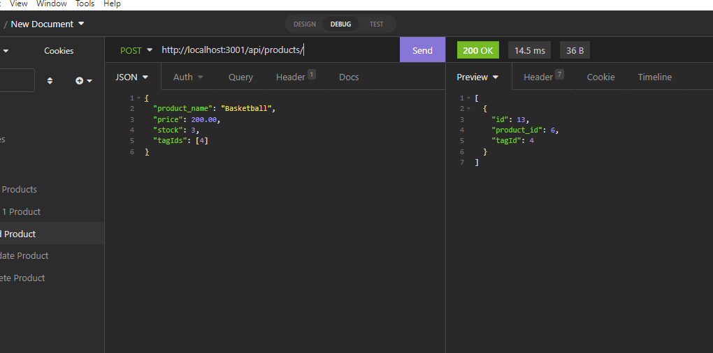

# **E-Commerce Application Back End**

## **Thumbnail**

## **Description**

- A Back End for an E-Comm website that allows the user, to GET, POST, UPDATE, and DELETE categories, products, and tags.

## **Built With**

- Javascript
- MySQL2
- Sequelize
  -Express

## **Table of Contents**

- [Installation](#installation)
- [Usage](#usage)
- [License](#license)
- [Contributing](#contributing)
- [Testing](#testing)
- [Questions](#questions)
- [Deployment](#deployment)

## **Installation**

- Download from GitHub.

## **Usage**

- [Init video](./assets/mysql.mp4) and [Demo video](./assets/demo.mp4)

## **License**

- Unlicense

## **Contributing**

How to Contrubute

- Open Source baby.

## **Testing**

- n/a

## **Questions**

Made with ❤️💧🩸

- www.github.com/JonCurls

## **Deployment**

https://github.com/JonCurls/e-commerce
